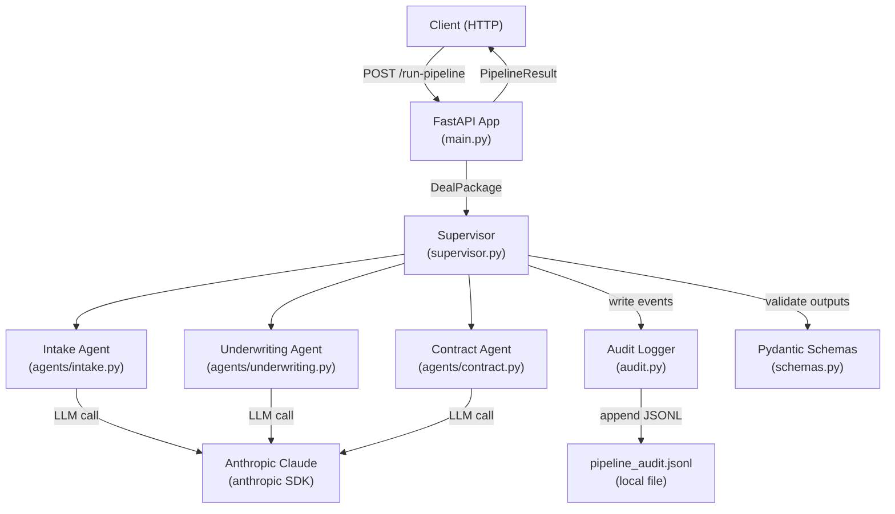
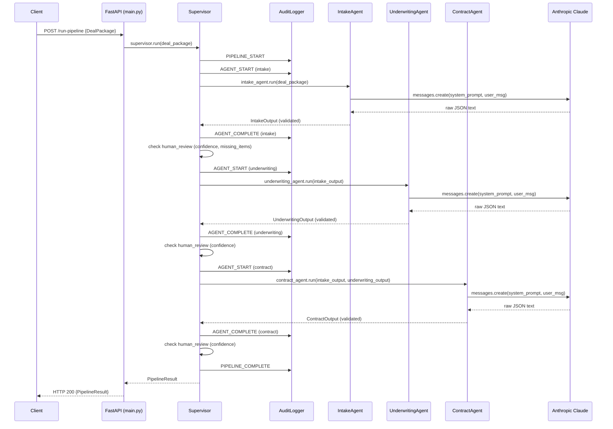
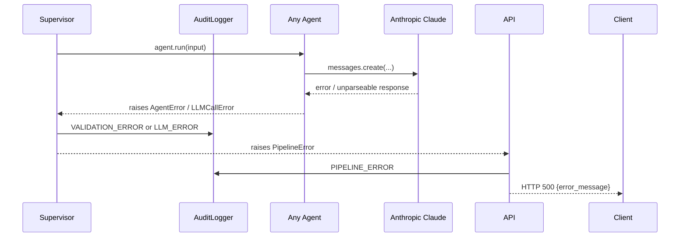

# Design Document: OceanX AI Underwriting Pipeline

## Overview

The OceanX AI Underwriting Pipeline is a Python/FastAPI service that automates SME deal processing through a sequential three-agent AI pipeline. A single REST endpoint (`/run-pipeline`) accepts raw deal packages and returns a fully structured result containing parsed deal data, a credit memo, and a draft contract — with every intermediate event written to a local JSONL audit log. The Supervisor orchestrates the three agents in strict sequence, validates each output against a Pydantic schema, and sets a Human Review Flag whenever confidence is low or required data is missing.

The system is designed around three core principles: **strict schema boundaries** between pipeline stages (Pydantic models as contracts), **full auditability** (every event appended to a JSONL log), and **fail-fast error propagation** (any agent failure halts the pipeline and is recorded before returning an error response).

---

## Architecture



---

## Module / File Structure

```
app/
├── main.py                  # FastAPI application, /run-pipeline endpoint
├── supervisor.py            # Supervisor: orchestration, validation, flagging
├── audit.py                 # AuditLogger: JSONL file writer
├── schemas.py               # All Pydantic models
└── agents/
    ├── __init__.py
    ├── base.py              # BaseAgent: shared LLM call logic
    ├── intake.py            # IntakeAgent
    ├── underwriting.py      # UnderwritingAgent
    └── contract.py          # ContractAgent
```

---

## Components and Interfaces

### FastAPI Application (`main.py`)

**Purpose**: Exposes the HTTP entry point, wires together the Supervisor, and maps exceptions to HTTP responses.

**Interface**:
```python
@app.post("/run-pipeline", response_model=PipelineResult)
async def run_pipeline(deal_package: DealPackage) -> PipelineResult:
    ...
```

**Responsibilities**:
- Parse and validate the incoming `DealPackage` request body (FastAPI/Pydantic handles HTTP 422 automatically)
- Instantiate and invoke the `Supervisor`
- Catch unhandled exceptions, write an error audit event, and return HTTP 500
- Return the `PipelineResult` as JSON with HTTP 200 on success

---

### Supervisor (`supervisor.py`)

**Purpose**: Orchestrates the three agents in sequence, validates outputs, sets the Human Review Flag, and writes all audit events.

**Interface**:
```python
class Supervisor:
    def __init__(self, audit_logger: AuditLogger) -> None: ...

    def run(self, deal_package: DealPackage) -> PipelineResult: ...

    def _check_human_review(
        self,
        run_id: str,
        agent_name: str,
        confidence: float,
        missing_items: list[str] | None = None,
    ) -> bool: ...
```

**Responsibilities**:
- Generate a unique `run_id` (UUID4) for each pipeline invocation
- Invoke agents in fixed order: Intake → Underwriting → Contract
- Write `AGENT_START` and `AGENT_COMPLETE` audit events around each agent call
- Validate each agent output against its Pydantic schema; on failure write `VALIDATION_ERROR` and raise
- Evaluate Human Review Flag conditions after each agent completes
- Write `HUMAN_REVIEW_FLAGGED` audit event when the flag is set, recording agent name and reason
- Assemble and return the final `PipelineResult`

---

### BaseAgent (`agents/base.py`)

**Purpose**: Shared logic for constructing LLM calls via the Anthropic SDK and parsing JSON responses.

**Interface**:
```python
class BaseAgent:
    def __init__(self, client: anthropic.Anthropic) -> None: ...

    def _call_llm(
        self,
        system_prompt: str,
        user_message: str,
        model: str = "claude-3-5-sonnet-20241022",
    ) -> str: ...

    def _parse_json_response(self, raw: str) -> dict: ...
```

**Responsibilities**:
- Hold a reference to the shared `anthropic.Anthropic` client
- Construct and send `messages.create` calls with a system prompt and user message
- Extract the text content from the response
- Parse the text as JSON; raise a structured `LLMParseError` on failure, including the raw response
- Propagate Anthropic SDK errors as `LLMCallError`

---

### IntakeAgent (`agents/intake.py`)

**Purpose**: Parses raw deal documents into structured JSON and identifies missing required items.

**Interface**:
```python
class IntakeAgent(BaseAgent):
    def run(self, deal_package: DealPackage) -> IntakeOutput: ...
```

**System Prompt Design**:
```
You are an expert SME trade finance document analyst.
Your task is to extract structured deal data from the provided raw documents.

Return ONLY a valid JSON object with this exact structure:
{
  "deal_data": { ... },   // all extracted structured fields
  "missing_items": [...], // list of required fields/documents that are absent
  "confidence_score": 0.0 // float 0.0-1.0 reflecting completeness and clarity
}

Do not include any explanation or markdown — return raw JSON only.
```

**Responsibilities**:
- Serialize the `DealPackage` into a user message string
- Call `_call_llm` with the intake system prompt
- Parse the response and validate against `IntakeOutput`
- Raise `AgentError` with raw LLM response and parse failure reason on any failure

---

### UnderwritingAgent (`agents/underwriting.py`)

**Purpose**: Analyzes financial data, scores risk, determines a credit limit, detects anomalies, and produces a credit memo.

**Interface**:
```python
class UnderwritingAgent(BaseAgent):
    def run(self, intake_output: IntakeOutput) -> UnderwritingOutput: ...
```

**System Prompt Design**:
```
You are an expert SME credit analyst.
Analyze the structured deal data provided and produce a risk assessment.

Return ONLY a valid JSON object with this exact structure:
{
  "risk_score": 0.0,          // float 0.0-1.0 (higher = higher risk)
  "credit_limit": 0.0,        // recommended credit limit in USD
  "anomalies": [...],         // list of detected anomalies in financial figures
  "credit_memo": "...",       // full credit memo text
  "confidence_score": 0.0     // float 0.0-1.0 reflecting data quality
}

Do not include any explanation or markdown — return raw JSON only.
```

**Responsibilities**:
- Serialize `IntakeOutput` into a user message string
- Call `_call_llm` with the underwriting system prompt
- Parse the response and validate against `UnderwritingOutput`
- Raise `AgentError` with raw LLM response and parse failure reason on any failure

---

### ContractAgent (`agents/contract.py`)

**Purpose**: Generates a deal-specific draft contract including the approved credit limit and pricing terms.

**Interface**:
```python
class ContractAgent(BaseAgent):
    def run(
        self,
        intake_output: IntakeOutput,
        underwriting_output: UnderwritingOutput,
    ) -> ContractOutput: ...
```

**System Prompt Design**:
```
You are an expert SME trade finance contract drafter.
Using the structured deal data and credit memo provided, generate a draft contract.

Return ONLY a valid JSON object with this exact structure:
{
  "contract_text": "...",     // full draft contract text
  "pricing_terms": { ... },   // structured pricing terms object
  "confidence_score": 0.0     // float 0.0-1.0 reflecting input completeness
}

Do not include any explanation or markdown — return raw JSON only.
```

**Responsibilities**:
- Combine `IntakeOutput` and `UnderwritingOutput` into a user message string
- Call `_call_llm` with the contract system prompt
- Parse the response and validate against `ContractOutput`
- Raise `AgentError` with raw LLM response and parse failure reason on any failure

---

### AuditLogger (`audit.py`)

**Purpose**: Appends structured JSON records to a local JSONL file, one record per line.

**Interface**:
```python
class AuditLogger:
    def __init__(self, log_path: str = "pipeline_audit.jsonl") -> None: ...

    def write(
        self,
        run_id: str,
        event_type: str,
        agent_name: str | None,
        payload_summary: dict,
    ) -> None: ...
```

**Responsibilities**:
- Create the JSONL file if it does not exist (using append mode, which creates on first write)
- Construct a record containing: UTC ISO 8601 timestamp, `run_id`, `event_type`, `agent_name`, `payload_summary`
- Serialize the record to a single-line JSON string and append it with a newline
- Ensure writes are atomic at the record level (one `write()` call = one line)

**Audit Event Types**:

| Event Type | When Written |
|---|---|
| `PIPELINE_START` | Before first agent is invoked |
| `AGENT_START` | Before each agent call |
| `AGENT_COMPLETE` | After each agent returns a valid output |
| `VALIDATION_ERROR` | When Pydantic schema validation fails |
| `HUMAN_REVIEW_FLAGGED` | When the Human Review Flag is set |
| `LLM_ERROR` | When an Anthropic API call fails |
| `PIPELINE_COMPLETE` | After all three agents succeed |
| `PIPELINE_ERROR` | On any unhandled exception |

---

## Data Models (`schemas.py`)

```python
from pydantic import BaseModel, Field
from typing import Any

class DealPackage(BaseModel):
    documents: list[str]          # raw deal document strings
    metadata: dict[str, Any] = {} # optional deal metadata

class IntakeOutput(BaseModel):
    deal_data: dict[str, Any]
    missing_items: list[str]
    confidence_score: float = Field(ge=0.0, le=1.0)

class UnderwritingOutput(BaseModel):
    risk_score: float = Field(ge=0.0, le=1.0)
    credit_limit: float = Field(ge=0.0)
    anomalies: list[str]
    credit_memo: str
    confidence_score: float = Field(ge=0.0, le=1.0)

class ContractOutput(BaseModel):
    contract_text: str
    pricing_terms: dict[str, Any]
    confidence_score: float = Field(ge=0.0, le=1.0)

class PipelineResult(BaseModel):
    run_id: str
    intake: IntakeOutput
    underwriting: UnderwritingOutput
    contract: ContractOutput
    human_review_required: bool
    status: str                   # "success" | "error"
    error_message: str | None = None
```

---

## Data Flow Through the Pipeline



### Error Path



---

## Key Design Decisions

### 1. JSON-Only LLM Responses

All three agents instruct the LLM via the system prompt to return **raw JSON only** — no markdown fences, no explanatory text. This makes `json.loads()` the sole parsing step and avoids fragile regex extraction. If the response is not valid JSON, the agent raises immediately with the raw text included in the error for debugging.

### 2. Pydantic as Stage Boundaries

Each agent returns a typed Pydantic model, not a raw dict. The Supervisor validates agent outputs by constructing the Pydantic model from the parsed dict (`IntakeOutput(**parsed_dict)`). This means validation errors surface as `pydantic.ValidationError` with field-level detail, which is captured in the audit log before the pipeline halts.

### 3. Shared Anthropic Client

A single `anthropic.Anthropic` instance is created at application startup (reading `ANTHROPIC_API_KEY` from the environment) and injected into all three agents via the `BaseAgent` constructor. This avoids redundant client initialization and centralizes credential handling.

### 4. Human Review Flag Logic

The flag is evaluated by the Supervisor after each agent completes — it is **sticky**: once set to `True` it cannot be reset to `False` within a run. Two conditions trigger it:
- Any agent's `confidence_score < 0.75`
- `IntakeOutput.missing_items` is non-empty

Both conditions are checked independently; either is sufficient to set the flag.

### 5. Audit Log Append-Only Design

The `AuditLogger` opens the file in append mode (`"a"`) for every `write()` call. This is intentionally simple: no file handles are held open between writes, which avoids file descriptor leaks and makes the logger safe to use across async contexts without locking. The trade-off is a small per-write open/close overhead, which is acceptable given pipeline throughput.

### 6. Synchronous Pipeline Execution

The pipeline runs synchronously within the FastAPI request handler. The three LLM calls are sequential by design (each agent depends on the previous agent's output), so there is no benefit to async concurrency within a single pipeline run. FastAPI's async endpoint wraps the synchronous `supervisor.run()` call using `asyncio.run_in_executor` to avoid blocking the event loop.

### 7. Error Hierarchy

```python
class PipelineError(Exception): ...          # base for all pipeline errors
class AgentError(PipelineError):             # agent-level parse/validation failure
    raw_response: str
    reason: str
class LLMCallError(PipelineError):           # Anthropic SDK error
    original_error: Exception
class ValidationError(PipelineError):        # Pydantic schema mismatch
    field_errors: list[dict]
```

This hierarchy lets the Supervisor catch specific error types, write the appropriate audit event type, and re-raise as a generic `PipelineError` for the FastAPI handler to catch and convert to HTTP 500.

---

## LLM Prompt Structure

Each agent uses a two-part prompt:

**System Prompt** (static, defined per agent):
- Establishes the agent's role and expertise
- Specifies the exact JSON output schema with field names and types
- Explicitly forbids markdown, prose, or any non-JSON output
- Includes field-level descriptions to guide the LLM

**User Message** (dynamic, constructed per invocation):
- Serializes the agent's input data as a JSON string
- Prefixed with a brief instruction: `"Process the following deal data and return the structured JSON output:"`

This separation keeps the schema contract in the system prompt (stable, cacheable) and the variable data in the user message.

---

## Environment Configuration

| Variable | Required | Description |
|---|---|---|
| `ANTHROPIC_API_KEY` | Yes | Anthropic API key; read at startup |
| `AUDIT_LOG_PATH` | No | Path to JSONL audit log file (default: `pipeline_audit.jsonl`) |
| `LLM_MODEL` | No | Claude model name (default: `claude-3-5-sonnet-20241022`) |
| `CONFIDENCE_THRESHOLD` | No | Human review threshold (default: `0.75`) |

---

## Error Handling Strategy

| Scenario | Handler | Audit Event | HTTP Response |
|---|---|---|---|
| Invalid request body | FastAPI/Pydantic | — | 422 |
| LLM API error | `BaseAgent._call_llm` | `LLM_ERROR` | 500 |
| LLM response not valid JSON | `BaseAgent._parse_json_response` | `VALIDATION_ERROR` | 500 |
| Agent output fails Pydantic schema | `Supervisor` | `VALIDATION_ERROR` | 500 |
| Unhandled exception | FastAPI exception handler | `PIPELINE_ERROR` | 500 |
| Low confidence / missing items | `Supervisor` | `HUMAN_REVIEW_FLAGGED` | 200 (flagged) |

---

## Property-Based Testing Considerations

The following properties are suitable for property-based testing (e.g., using [Hypothesis](https://hypothesis.readthedocs.io/)):

### Schema Validation Properties

- **Roundtrip integrity**: For any valid `IntakeOutput`, serializing to dict and re-constructing via `IntakeOutput(**d)` produces an equal object.
- **Confidence score bounds**: For any agent output, `0.0 <= confidence_score <= 1.0` always holds after Pydantic validation.
- **Credit limit non-negative**: For any `UnderwritingOutput`, `credit_limit >= 0.0` always holds.

### Human Review Flag Properties

- **Flag monotonicity**: Once `human_review_required` is set to `True` during a run, it is never set back to `False`.
- **Flag completeness**: For any `PipelineResult` where any agent's `confidence_score < 0.75`, `human_review_required == True`.
- **Missing items trigger**: For any `PipelineResult` where `intake.missing_items` is non-empty, `human_review_required == True`.

### Audit Log Properties

- **Every run produces at least one record**: For any completed pipeline run (success or error), the audit log contains at least one record with the matching `run_id`.
- **Record structure**: Every audit record contains `timestamp`, `run_id`, `event_type`, and `payload_summary` fields.
- **Append-only**: The number of lines in the audit log never decreases between pipeline runs.
- **JSONL validity**: Every line in the audit log is independently parseable as valid JSON.

### Pipeline Orchestration Properties

- **Agent order invariant**: The sequence of `AGENT_START` events in the audit log for a given `run_id` is always `intake → underwriting → contract`.
- **Run ID uniqueness**: No two concurrent pipeline runs share the same `run_id`.

### Suggested Test Library

Use **Hypothesis** with `@given` strategies:
- `st.text()` for document strings
- `st.floats(min_value=0.0, max_value=1.0)` for confidence scores
- `st.lists(st.text())` for missing items
- `st.fixed_dictionaries(...)` for structured deal data

Mock the Anthropic client using `unittest.mock.patch` to return controlled JSON strings, allowing property tests to run without live API calls.

---

## Dependencies

| Package | Purpose |
|---|---|
| `fastapi` | HTTP framework and request/response handling |
| `uvicorn` | ASGI server |
| `pydantic` | Schema definition and validation |
| `anthropic` | Anthropic Claude SDK for LLM calls |
| `python-dotenv` | Load `ANTHROPIC_API_KEY` from `.env` in development |
| `hypothesis` | Property-based testing |
| `pytest` | Test runner |
| `pytest-asyncio` | Async test support for FastAPI endpoints |
